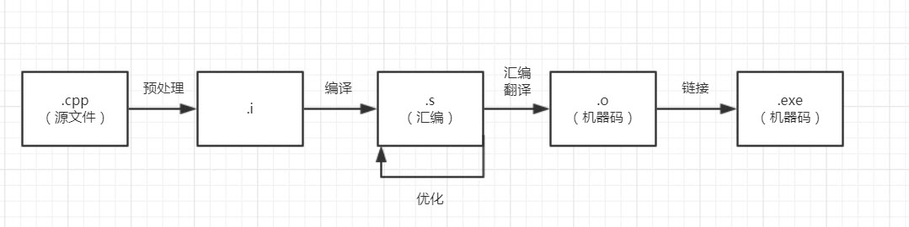

# 总结 -- 18-2-4

> **Author：胡子昂** </br>
> **总结项目：Magic Word解题**
---

## Part 1：

## 过程中学到的新东西：

- time脚本程序的使用
  ```bash
  Usage: time EXE
  $ time ./huziangBFS ../in4 out

  real    0m0.355s
  user    0m0.324s
  sys     0m0.028s
  ```
  PS：这个EXE可以是自己的脚本程序，也可以是系统指令

- perf脚本程序的使用
  ```bash
  Usage: perf record EXE && perf report
  $ perf record ./huziangBFS ../in4 out
  $ perf report
  ```

- gdb的使用
  ```bash
  $ g++ -g FILE.cpp -o EXE
  $ gdb EXE
  ```

  gdb一些特殊参数：

  ```shell
  s : 单步进入
  l : 显示源文件
  b <function name> : 在函数开头添加断点
  d : 删除所有断点
  ```

- 编译，链接，动态链接究竟是什么？

  编译是将.cpp文件或者.cpp经过预处理后的.i文件进行翻译，翻译成汇编代码或中间代码。

  （静态）链接是将多个.o文件中的函数或变量进行补全，然后组合形成一个新的可执行文件，该可执行文件可以独立使用。

  动态链接是将多个.so文件中的函数或变量进行填充，组合成一个可执行文件，填充地址并不是真正的实际地址，而是表中的地址，该表会在执行时查找对应的.so文件进行补全。因此，与静态链接比，动态链接生成的可执行文件小，但一定要依赖.so文件才能执行。

- 从.cpp文件到可执行文件的过程是怎么样的？

  

- .s,.o,.a,.so分别是什么意思？

  .s是.cpp文件编译后的汇编码文件

  .o是.s文件汇编翻译后的机器码文件，仅包含0/1，此时，变量和函数没有指向真正的地址，相应部分空出来

  .a是.o的集合

  .so也是机器码文件，和.o不同的是，.o文件在连接后空的部分就会补全成正确地址，.so在连接后空的部分会补全到表中的地址，并不是正确地址

- c++中set存储指针如何进行相等比较？

  使用方法如下：

  ```c++
  struct NodeCompare {
  	bool operator () (const Node *n1, const Node *n2) {
  		return n1->str < n2->str;
  	}
  };
  set<Node*, NodeCompare> store;
  ```

  ​

- 动态规划不仅仅可以一次动态规划，还可以组合使用两次动态规划

- 温习BFS和DFS

## 程序出现的问题：

- 拷贝复制严重，非常影响内存使用空间和程序执行速度
- 在不需要太多所用功能时，使用stl并不算是一个太好的选择。
- 数组声明最好使用变量声明，而不是使用常数

---

## Part 2：

## 动态规划方法总结：

> PS1：此方法是错误的，或者说，不完全正确的，正确方法的分析在后半部分，在此先提个醒。 </br>
>
> PS2：此方法只求了结果，没有求求解过程，但是稍加改良即可得出求解过程。

该方法使用了两次动态规划，分别命名为dpfull和dpnotfull。其中第二次动态规划dpnotfull建立在第一次动态规划的结果上。代码[点我查看](https://github.com/bilibiliChangKai/WQ-my-code/blob/master/magic-word/DP/magic-word.cpp) 。

设母字符串为str，母字符串长度为n，子字符串一共有k个，分别为s1...sk，字符串长度分别为l1...lk，对应value分别为v1...vk。接下来分别求解两个动态规划方程。

### dpfull：

dpfull(i, j)：在子字符串完全匹配母字符串的情况下，用动态规划求出用一种方法完全匹配str[i, j)，并且总值最大。该动态规划的状态数为$n^2$ ，转移数为$n \cdot k$，因此时间复杂度为$O(n^3 \cdot k)$ 

递推式为：
$$
\begin{equation}
*All\ dpfull(x, y)\ is\ -1\ at\ begin \\
dpfull(x, y) =
\begin{cases}
	0 & x=y  \\
	for\ i\ in\ [1... k]: \\
	\ \ \ \ for\ j\ in\ [0...length(s_i)]:  \\
	\ \ \ \ \ \ \ \  l, r = split\ s_i\ by\ pos\ j  \\
	\ \ \ \ \ \ \ \ if\ (l\ is\ prefix\ in str[i, j) \\
          \ \ \ \ \ \ \ \ \&\& \ r\ is\ posftix\ in\ str[i, j)  \\
          \ \ \ \ \ \ \ \ \&\& \ dpfull(x + j, y - l_i + j)\ != -1)  \\
          \ \ \ \ \ \ \ \ \ \ \ \ dpfull(x, y) = max(dpfull(x, y), dpfull(x + j, y - l_i + j) + v_i)
	 & x<y  \\
	-1 & x  > y \\ 
\end{cases}
\end{equation}
$$
其中，-1代表不能完全匹配，正值代表可以完全匹配并且该值是最大值。

**举个例子：**

母串为：

AAAA

子串为：

AA 2

AAAA 3

可计算dpfull为（从0开始）：

$\begin{matrix} 0 & -1 & 2 & -1 & 4 \\ -1 & 0 & -1 & 2 & -1 \\  -1 & -1 & 0 & -1 & 2 \\ -1 & -1 & -1 & 0 & -1 \\ -1 & -1 & -1 & -1 & 0  \end{matrix}$

在这个例子中：

- A和AAA都无法匹配，因此为-1
- AA只有一种匹配，因此为2
- AAAA有两种匹配，其中，匹配两次AA的值最大，因此为4

### dpnotfull：

dpnotfull(i, j)：子字符串可以完全匹配母字符串，也可以不完全匹配母字符串，用动态规划求出一种方法匹配str[i, j)，并且总值最大，易知，dpnotfull(0, n)即我们所求的答案。该动态规划的状态数为$n^2$ ，转移数为$n$，因此时间复杂度为$O(n^3)$ 

递推式为：
$$
\begin{equation}
*All\ dpnotfull(x, y)\ is\ 0\ at\ begin \\
dpnotfull(x, y) =
\begin{cases}
	0 & x=y  \\
	for\ i\ in\ (x... y): \\
          \ \ \ \ dpnotfull(x, y) = max(dpnotfull(x, y), dpnotfull(x, i) + dpnotfull(i, y))  \\
          dpnotfull(i, j) = max(dpnotfull(x, y), dpfull(i, j))
	 & x<y  \\
\end{cases}
\end{equation}
$$
其中，正值或0代表任意匹配的最大值。

**以刚刚的例子为例：**

计算dpnotfull为（从0开始）：

$\begin{matrix} 0 & 0 & 2 & 2 & 4 \\  0& 0& 0& 2& 2\\  0& 0& 0& 0& 2\\ 0& 0& 0& 0& 0\\0& 0& 0& 0& 0 \end{matrix}$

在这个例子中：

- A无法匹配任意子串，因此为0
- AA可以匹配子串AA，因此为2
- AAA包含子串AA，因此为2
- AAAA有两种匹配，其中，匹配两次AA的值最大，因此为4

### 算法正确性证明：

我们可以将所有可能的最大值匹配情况分成四种：

1. 最大值匹配只有一个连续的匹配子串集合，刚好匹配了整个母字符串。例如：ABCDEFG匹配了ABCDEFG。
2. 最大值匹配只有一个连续的匹配子串集合，该子串匹配母字符串的头部或尾部。例如：ABCDEFG匹配了ABCD或DEFG。
3. 最大值匹配只有一个连续的匹配子串集合，该子串既不匹配母字符串的头部，也不匹配母字符串的尾部。例如：ABCDEFG匹配了CDE。
4. 最大值匹配有任意个连续的匹配子串集合，即最普通的情况。例如：ABCDEFG匹配了BC，E，G。

接下来，我们依次证明以上四种情况可以通过dpnotfull推出：

1. 易得，dpnotfull(x, y) = dpfull(x, y)

2. 可以找到一个间隔$\text{i} \in \text{(x, y)}$，使得dpnotfull(x, y) = dpnotfull(x, i) + dpnotfull(i, y)。这两个值中一个为0，一个为问题1。这样，我们就能把问题2分解成问题1，从而成功推导。

3. 同上，可以找到一个间隔$\text{i} \in \text{(x, y)}$，使得dpnotfull(x, y) = dpnotfull(x, i) + dpnotfull(i, y)。这两个值中一个为0，一个为问题2。这样，我们就能把问题3分解成问题2，从而成功推导。

4. 由于匹配的子串集合相互之前不连续，因此可以找到一个间隔$\text{i} \in \text{(x, y)}$，使得dpnotfull(x, y) = dpnotfull(x, i) + dpnotfull(i, y)。其中，dpnotfull(x, i)包含一个连续的子串集合，dpnotfull(i, y)包含剩下的子串集合，这样，我们就能把问题3分解成一个问题2和一个小一号的问题3，多次重复后，结果就变成了：

   $dpnotfull(x, y) = dpnotfull(x, i_1) + dpnotfull(i_1, i_2) + dpnotfull(i_2, i_3) + \cdots + dpnotfull(i_n, y)$

   这样，问题3被分解成了多个问题2，从而成功推导。

至此，我们可以证明，该动态规划是正确的！

---

## 问题？

到这里，可能就有人有疑问了，明明开头说的有问题，为什么这里又证明了正确呢？莫急莫急，让我们先看一个样例：

母串为：

ABCDE

子串为：

ACE 2

B 2

D 2

很明显，答案是6。但是让我们用自己的程序算一遍：

dpfull：

$\begin{matrix} 0 & -1 & -1 & -1 & -1& -1 \\ -1 & 0 & 2 & -1 & -1 & -1 \\  -1 & -1 & 0 & -1 & -1& -1 \\ -1 & -1 & -1 & 0 & 2& -1 \\ -1 & -1 & -1 & -1 & 0 & -1 \\ -1& -1 & -1 &-1 &-1 &0  \end{matrix}$

dpnotfull：

$\begin{matrix} 0 & 0 & 2 & 2 & 4& 4 \\ 0 & 0 & 2 & 2 & 4& 4 \\ 0 & 0 & 0 & 0 & 2& 2 \\ 0 & 0 & 0 & 0 & 2& 2 \\ 0 & 0 & 0 & 0 & 0& 0 \\ 0 & 0 & 0 & 0 & 0& 0 \end{matrix}$

答案：

4

大家应该已经发现了，dpfull(0, 5)应该是6，这样dpnotfull(0, 5) = dpfull(0, 5)，才是正确的答案。但是，在我们计算dpfull时，只考虑了子字符串分成两部分，匹配首尾两端的情况，没有考虑子字符串分成多个部分的情况。导致我们虽然思路正确，但是并没有考虑所有情况。

## 改进：（未实现）

### 改进思路

将dpfull递推部分改进正确即可，下面提供一种思路：

1. 对每个子串，事先寻找子串中每个字符在母串中的位置集合。然后根据子串中字符的顺序，连接集合，消除不符合递增顺序的结果。

   举个例子：

   母串：AABBC

   子串：ABC

   S(A) = {0, 1}

   S(B) = {2, 3}

   S(C) = {4}

   S(ABC) = {{0, 2, 4}, {0, 3, 4}, {1, 2, 4}, {1, 3, 4}}

2. 根据1中得到的集合，修改dpfull递推公式：

   $for\ i\ in\ [1...k]: \\$
   $\ \ \ \ for\ (j_1...j_n)\ in\ S(s_i): \\$
   $\ \ \ \ \ \ \ \ dpfull(x, y) = dpfull(x, j_1) + dpfull(j_1, j_2) + \cdots + dpfull(j_n, y)$

### 问题

此方法需要的时间复杂度大概为$O(n^4 \cdot k)$ ，可能和暴力搜索所花的复杂度相差无几！