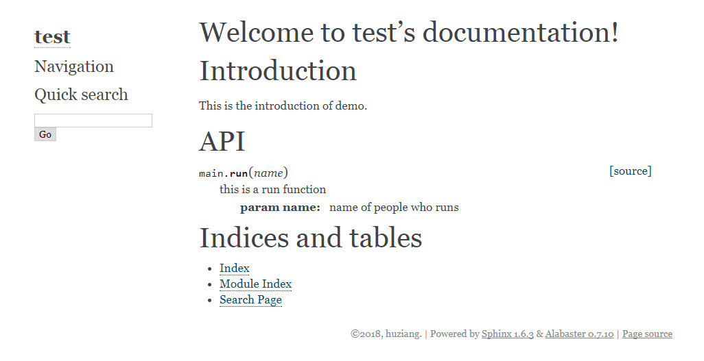
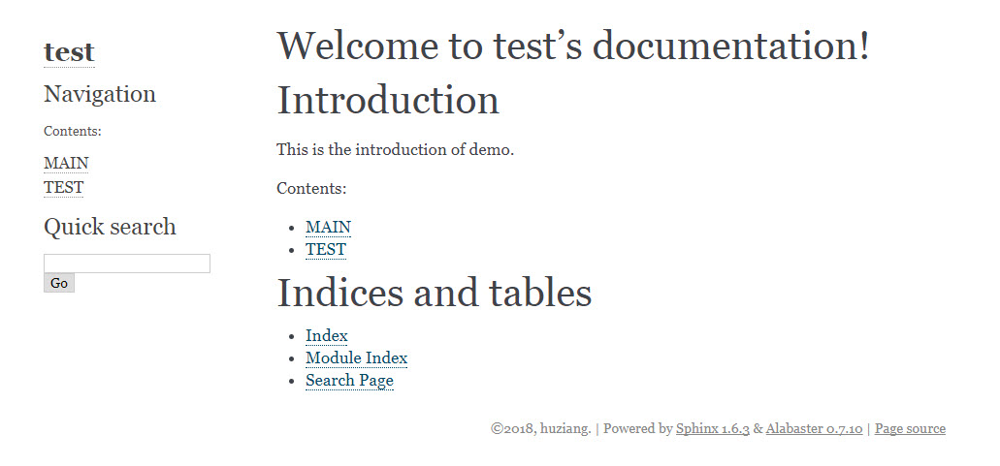
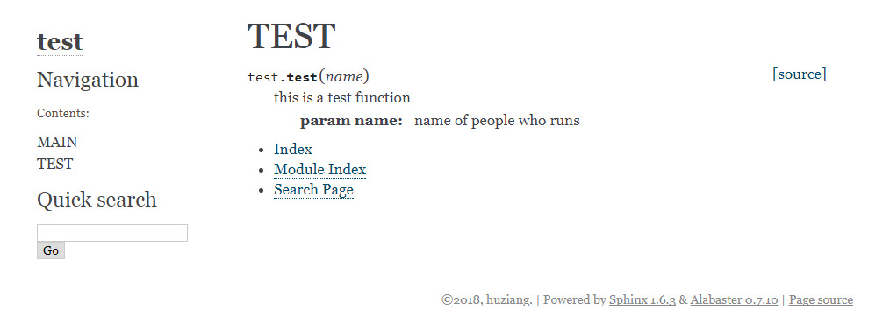

# python sphinx 自动生成文档

> 借鉴：http://blog.csdn.net/preyta/article/details/73647937 </br>
> 在此基础上进行修改扩展

## 前言：

sphinx是python支持的一种文档自动生成工具，仅需少量操作，就可以把docstring注释生成文档，文档可以是html格式，latex格式，pdf格式等。

## 安装：

使用pip安装。如果连pip都没有，请先安装anoconda。

···bash
$ pip install sphinx
···

## 创建项目

创造一个sphinx文件夹，输入以下指令：

~~~bash
$ sphinx-quickstart
~~~

影响比较大的有下面几条：

~~~bash

 # 将source文件夹与build文件夹分离，建议选y
> Separate source and build directories (y/n) [n]: y
 
 # 自动插入模块中的docstring注释，不用想，无脑y
> autodoc: automatically insert docstrings from modules (y/n) [n]: y

 # 是否让文件中包含你的源代码，可酌情选择
> viewcode: include links to the source code of documented Python objects (y/n) [n]: y
~~~

输入完后，默认的目录就生成了，目录结构如下：

~~~bash
$ ls -l
total 5
drwxr-xr-x 1 Administrator 197121   0 二月  2 16:47 build/
-rw-r--r-- 1 Administrator 197121 806 二月  2 16:47 make.bat
-rw-r--r-- 1 Administrator 197121 608 二月  2 16:47 Makefile
drwxr-xr-x 1 Administrator 197121   0 二月  2 16:47 source/
~~~

### **解释一下文件夹内容：**
- source 存放生成的模板和py脚本
- build 存放生成的文档目前为空
- makefile 加工source的模板成文档，并将文档放入build文件夹里

进入source文件夹，文件夹内容如下：

~~~bash
$ ll
total 9
drwxr-xr-x 1 Administrator 197121    0 二月  2 16:47 _static/
drwxr-xr-x 1 Administrator 197121    0 二月  2 16:47 _templates/
-rw-r--r-- 1 Administrator 197121 5334 二月  2 16:47 conf.py
-rw-r--r-- 1 Administrator 197121  448 二月  2 16:47 index.rst
~~~

其中：
- conf.py 可以修改之前quickstart定下的配置
- index.rst 在makefile后生成文档的主目录

## 添加python文件

现在，我们有了一个新的空目录，我们可以在这个基础上扩展：
新建一个main.py文件到该目录，文件内容如下：

~~~python
# main.py
def run(name):
    """
    this is a run function
        :param name: name of people who runs
    """
    print name, 'is running'
~~~

将之前生成的文件夹放入和main.py的同一个文件夹内，结构如下：

~~~bash
$ ls -l
total 1
-rw-r--r-- 1 Administrator 197121 146 二月  2 17:02 main.py
drwxr-xr-x 1 Administrator 197121   0 二月  2 17:04 sphinx/
~~~

由于main.py的路径未知，因此需要先添加main.py文件夹的路径。
进入sphinx文件夹，修改conf.py，在开头添加以下语句：

~~~python
import os
import sys
sys.path.insert(0, os.path.abspath('../'))
~~~


然后修改index.rst的内容：

~~~rst
.. test documentation master file, created by
   sphinx-quickstart on Fri Feb 02 16:47:00 2018.
   You can adapt this file completely to your liking, but it should at least
   contain the root `toctree` directive.

Welcome to test's documentation!
================================

.. toctree::
   :maxdepth: 2
   :caption: Contents:

Introduction
============
This is the introduction of demo。

API
===
.. automodule:: main
   :members:


Indices and tables
==================

* :ref:`genindex`
* :ref:`modindex`
* :ref:`search`

~~~

实际上，rst是一种标记语言，类似markdown，有兴趣的可以自己去了解。但是如果不深究的话，知道两点就可以：

- ```rst
  .. toctree::
     :maxdepth: 2
     :caption: Contents:
  ```

  toctree生成了一个节点，此节点必须。

- ~~~rst
  .. automodule:: main
     :members:
  ~~~

  automodule即自动生成模块，后面跟着py文件的文件名。（此处main即指我们刚刚编写的main.py文件）

通过这两个语法，我们就能自动生成简单的文档。

## 创建文档

进入sphinx文件夹，运行以下指令：

~~~bash
$ sphinx-build -b html source build
$ make html  # (linux)
or
$ ./make.bat html # (windows)
~~~

运行完毕后，就可以在build文件夹看到生成的html，效果如下：



可以看到，我们的自动生成文档已经成功！

## 进阶

在项目较大时，我们的py文件会不止一个，我们可以将py文件和html文档一一对应，这样就可以分散式管理文档。

新建第二个test.py文件，内容如下：

~~~python
# test.py
def test(name):
    """
    this is a test function
        :param name: name of people who runs
    """
    print name, 'is testing'
~~~

我们进入到sphinx/source中，添加test.rst，main.rst两个文件。

main.rst:

~~~rst
MAIN
====
.. automodule:: main
   :members:

* :ref:`genindex`
* :ref:`modindex`
* :ref:`search`
~~~

test.rst:

~~~rst
TEST
====
.. automodule:: test
   :members:

* :ref:`genindex`
* :ref:`modindex`
* :ref:`search`
~~~

并且修改index.rst如下：

~~~rst
.. test documentation master file, created by
   sphinx-quickstart on Fri Feb 02 16:47:00 2018.
   You can adapt this file completely to your liking, but it should at least
   contain the root `toctree` directive.

Welcome to test's documentation!
================================

Introduction
============
This is the introduction of demo.

.. toctree::
   :maxdepth: 2
   :caption: Contents:

   main
   test


Indices and tables
==================

* :ref:`genindex`
* :ref:`modindex`
* :ref:`search`
~~~

重新执行上面两句指令，打开index.html，效果如下：



打开TEST链接，效果如下：



如果还有新的new.py文件加入的话，新建一个XXX.rst文件，添加automodule指令，并在index.rst文件内添加XXX即可。